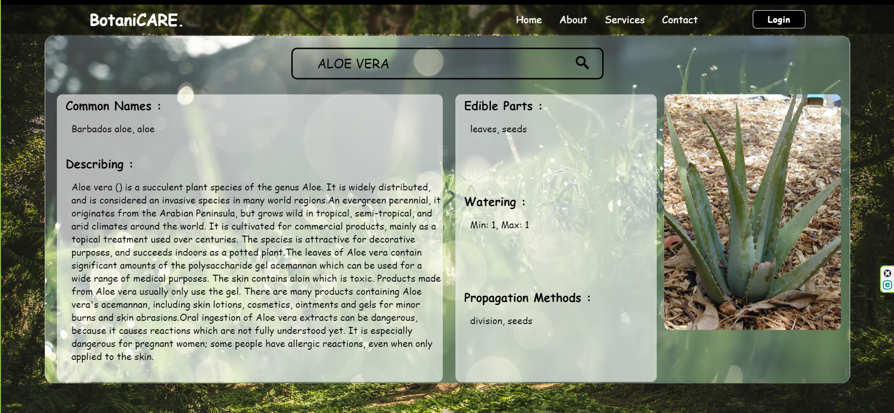
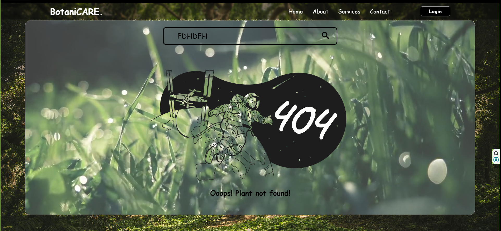
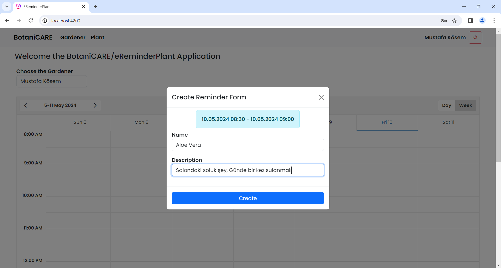

# botaniCARE Uygulaması

## Uygulama Tanımı
botaniCARE, kullanıcıların bitkilerinin bakımını düzenli olarak yapmalarına ve bitki koleksiyonlarını yönetmelerine yardımcı olan bir mobil uygulamadır. Kullanıcılar, bitki profilleri oluşturabilir, bakım takvimleri yönetebilir, hatırlatıcılar ayarlayabilir ve bitki bakımıyla ilgili ipuçları ve bilgiler alabilirler. Ayrıca, geniş bir bitki veritabanından bitki türlerini arayabilir ve bitki profillerini oluşturmak için bitki bilgilerini alabilirler.

## Ekran Görüntüsü

       

## Uygulama Özellikleri

### 1. Bitki Profili Oluşturma
   - Kullanıcılar, bitkileri için profiller oluşturabilir.
   - Bitki profilleri genellikle bitkinin adı, türü, fotoğrafı ve bakım gereksinimleri gibi bilgiler içerir.

### 2. Bakım Takvimi
   - Kullanıcılar, bitkilerinin bakımını düzenli olarak yapmalarına yardımcı olacak bir takvime erişebilir.
   - Takvim, sulama, gübreleme, budama gibi bakım görevlerini gösterir ve kullanıcıları belirli görevlerin zamanına göre uyarır.

### 3. Hatırlatıcılar
   - Kullanıcılar, belirli bir zamanda veya periyodik olarak hatırlatmalar alabilir.
   - Hatırlatmalar, belirli bir bitkinin belirli bir bakım görevi için olabilir veya kullanıcı tarafından özelleştirilebilir.

### 4. Bakım İpuçları ve Bilgiler
   - Kullanıcılara bitki bakımı hakkında ipuçları, genel bakım bilgileri ve sorun giderme önerileri sağlanır.
   - Bu özellik, kullanıcıların bitkilerinin daha iyi bakımını sağlamalarına yardımcı olabilir.

### 5. Bitki Veritabanı
   - Kullanıcılar geniş bir bitki veritabanından bitki türlerini arayabilir ve bitki bilgilerini alabilirler.
   
### 6. Kullanıcı Profili
   - Kullanıcılar, bitki koleksiyonlarını yönetebilir ve geçmiş bakım geçmişlerini görebilirler.

## Kullanılan Teknolojiler

- **Frontend:**
  - Angular 17
  - TypeScript
  - HTML/CSS
  - RxJS (Reactive Extensions for JavaScript)

- **Backend:**
  - .NET 8
  - ASP.NET Core Web API
  - C#
  - Entity Framework Core (ORM)

- **Diğer Teknolojiler:**
  - JWT (JSON Web Tokens) for Authentication
  - Automapper for Object Mapping
  - CQRS (Command Query Responsibility Segregation) Pattern
  - Clean Architecture Principles

Bu dökümantasyon, botaniCARE uygulamasını geliştirmek için gerekli olan temel bilgileri sağlamaktadır. Uygulama geliştirme sürecinde herhangi bir sorunuz veya ihtiyacınız olduğunda bu dökümantasyonu başvuru kaynağı olarak kullanabilirsiniz.
